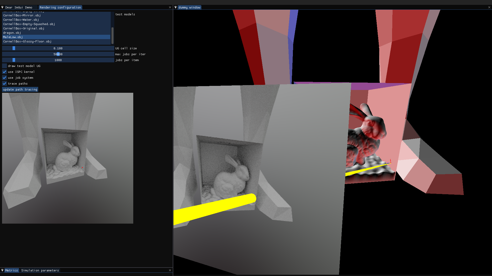
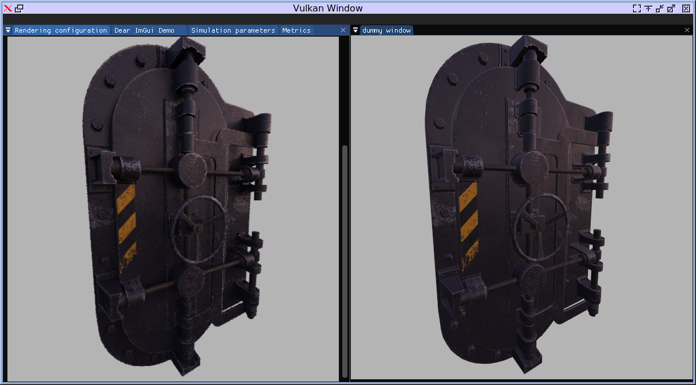
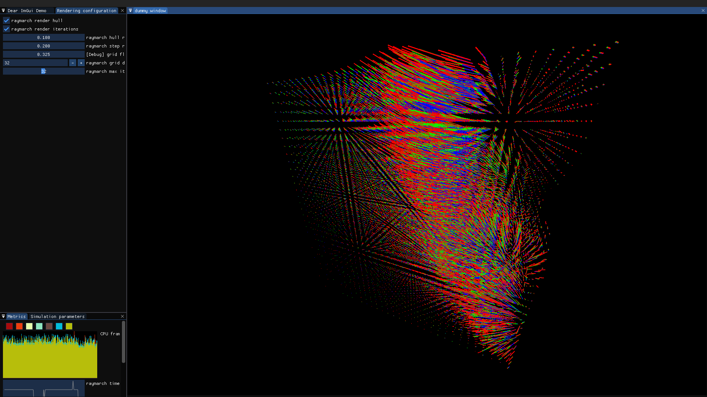

## Screenshots




## Dependencies
```console
## Install Lunarg-SDK and set up enviroment variables
## Arch Linux setup
sudo pacman -S cmake gcc unzip sparsehash glfw glslang gtest boost
```
## Build
```console
mkdir build
cd build
cmake ../
cmake --build . --target all
```
## Features
* Vulkan framework skeleton
* Shader reload with inotify/dir_update
* Gizmos
  * Translation
* ISPC/Naive path tracing
## TODO
* Asset pipeline
  * Proper serialization framework
  * Zip/Unzip
  * Shader reload with inotify/dir_update
    * Increase granularity
    * Don't crash if compilation fails
* Vulkan framework skeleton
  * Try bindless resources
* Gizmos
  * Rotation
* Try different raymarching optimizations
  * Marching simplices
  * Distance field compression
* Secondary rays
  * AO, GI

## References
Models downloaded from Morgan McGuire's [Computer Graphics Archive](https://casual-effects.com/data)

Models downloaded from [free3d](https://free3d.com/3d-model/low-poly-male-26691.html)  

Cubemap downloaded from [hdrihaven](https://hdrihaven.com/hdri/?h=industrial_pipe_and_valve_01)
